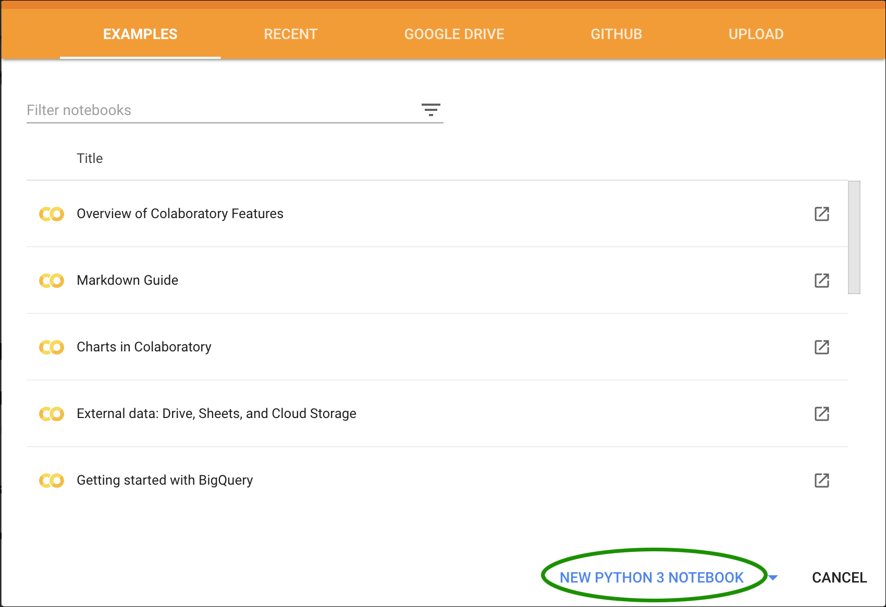
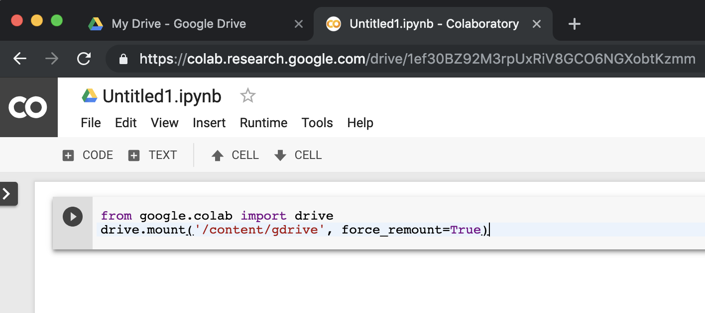
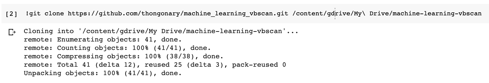
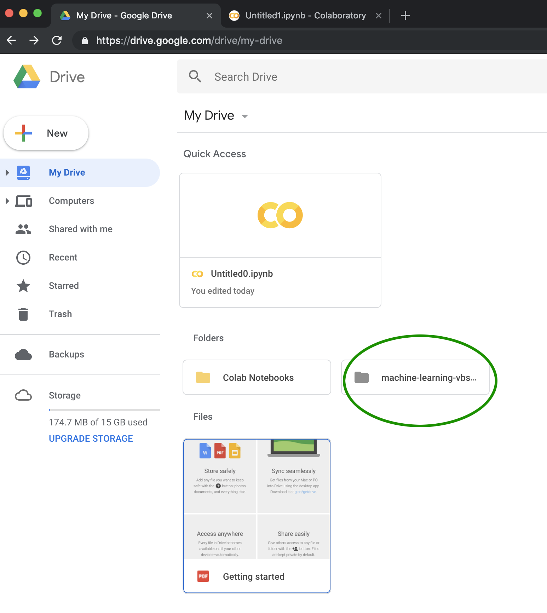
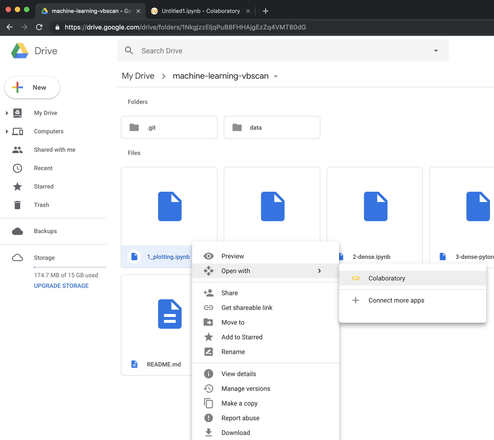

# Machine Learning Tutorials

Largely inspired from CMSDAS 2019 @LPC Machine Learning Exercise by Javier Duarte

## Introduction

This is a set of tutorials for the VBScan@Ljubljana training event. They are intended to show you how to build machine learning models in python (`Pytorch` and `Keras`/`TensorFlow`) and use them in your analyses. We will build event-level classifiers for differentiating VBF Higgs and standard model background 4 muon events and jet-level classifiers for differentiating boosted W boson jets from QCD jets.

## Main notebooks in this tutorial

 &nbsp;1. &nbsp;[`1-plotting.ipynb`](1-plotting.ipynb): plotting with `matplotlib`  
 &nbsp;2. &nbsp;[`2-dense.ipynb`](2-dense.ipynb): building, training, and evaluating a fully connected (dense) neural network in `Keras`  
 &nbsp;3. &nbsp;[`3-dense-pytorch.ipynb`](3-dense-pytorch.ipynb): Same with notebook 2, but with `PyTorch`  
 &nbsp;4. &nbsp;[`4-dense-bayesian-optimization.ipynb`](4-dense-bayesian-optimization.ipynb): Optimize a dense network with Bayesian optimization  
 &nbsp;5. &nbsp;[`5-conv2d.ipynb`](5-conv2d.ipynb): building, training, and evaluating a 2D convolutional neural network in `Keras`  

## Setup

We will be using Google Colab. Point your browser to:

[https://colab.research.google.com/](https://colab.research.google.com/)

On the Welcome page, click on `NEW PYTHON 3 NOTEBOOK`

<p align="center">
  
</p>

If you run a script which creates/ downloads files, the files will NOT persist after the allocated instance is shutdown. To save files, you need to permit your Colaboratory instance to read and write files to your Google Drive. Add the following code to the first cell:
```
from google.colab import drive
drive.mount('/content/gdrive', force_remount=True)
```
Then run it by clicking on the play button or Shift+Enter.
<p align="center">
  
</p>
You'll need to authenticate Google Colab to mount to your Drive. Follow the instruction on the output.

Now we will clone this repository to your Drive. Copy and run this line:
```
!git clone https://github.com/thongonary/machine_learning_vbscan.git /content/gdrive/My\ Drive/machine-learning-vbscan
```
<p align="center">
  
</p>

Go back to your Google Drive tab, you should see the cloned repository there:
<p align="center">
  
</p>

Inside, there are a list of notebook that we will use for this exercise. To open a notebook, right click on it and select Open with Collabotory.
<p align="center">
  
</p>
